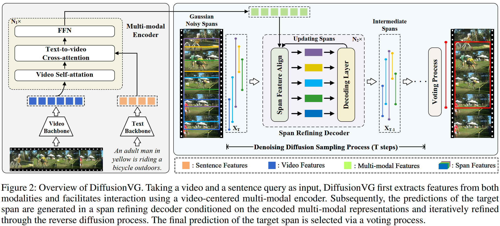

# Exploring Iterative Refinement with Diffusion Models for Video Grounding  

## 💡 Introduction
Implementation for DiffusionVG: Exploring Iterative Refinement with Diffusion Models for Video Grounding.

In this work, we propose a novel framework with diffusion models that **formulates video grounding as a conditioned generation task**, enhancing predictions through iterative refinement.

The full paper can be found at: [https://arxiv.org/abs/2310.17189](https://arxiv.org/abs/2310.17189)





### Results on Charades-STA  
| Feature | R@1 IoU=0.3 | R@1 IoU=0.5 | R@1 IoU=0.7 |
|---------|-------------|-------------|-------------|
| I3D     | 76.53       | 62.30       | 40.05       |
| VGG     | 70.38       | 57.13       | 35.06       |
### Results on Activitynet-Captions 
| Feature | R@1 IoU=0.3 | R@1 IoU=0.5 | R@1 IoU=0.7 |
|---------|-------------|-------------|-------------|
| C3D     | 65.02       | 47.27       | 27.87       |


## 🔥 Updates
+ 2024/10/23: Implementation is simplified!

+ 2024/03/16: The code associated with this work is fully open-sourced!

+ 2024/03/13: This work is accepted by ICME 2024. 

+ 2023/10/26: A demo implementation of DiffusionVG is updated (demo.py).


## ⚙️ Setup

We recommend using [Conda](https://docs.conda.io/projects/miniconda) to manage your environment. It is advised to use the latest versions of [torch](https://github.com/pytorch/pytorch) and [transformers](https://github.com/huggingface/transformers). To set up your environment, run the following commands:

```sh
git https://github.com/MasterVito/DiffusionVG.git && cd DiffusionVG
conda create -n diffusionvg python=3.10.14
conda activate diffusionvg
pip install -r requirements.txt
```

## 🚀 Quick Start
In order to help users **quickly review the implementation** of our proposed DiffusionVG, we have simplified the inference process into a demo script, which can be run as follows:
```sh
python demo.py
```

## 🍀 Video Feature Download
For Charades-STA, we utilize the [I3D features](https://pan.baidu.com/s/1hT0XNtykLSo2C2F2sz9X4g?pwd=5366) from [2D-TAN](https://github.com/microsoft/VideoX/tree/master/2D-TAN).

For Activitynet-Captions, we utilize the C3D features from the [official website](http://activity-net.org/challenges/2016/download.html#c3d).

After downloading the features, the default setting is to unzip them into the "features" folder. You can change the feature path to a custom directory using the "vid_feature_path" parameter.

## ⚡️ Training & Evalution
Start the training for DiffusionVG by running the following command. For details on parameter configurations, please refer to the script and **config.py**. Evaluations are integrated into the training process.
```sh
bash scripts/run_train.sh
```


## Citation

If you find our work helpful to your research, please consider citing our paper using the following format: 

```bibtex
@inproceedings{liang2024exploring,
  title={Exploring iterative refinement with diffusion models for video grounding},
  author={Liang, Xiao and Shi, Tao and Liang, Yaoyuan and Tao, Te and Huang, Shao-Luo},
  booktitle={2024 IEEE International Conference on Multimedia and Expo (ICME)},
  pages={1--6},
  year={2024},
  organization={IEEE}
}
```